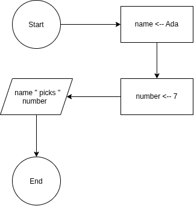

# Debugging Warm-Up 01

This program has two variables, a string slice and a 32 bit integer.

## Pseudocode

```
FUNCTION main()
    DECLARE name : STRING
    DECLARE number : INTEGER
     
    name <-- "Ada"
    number <-- 7

    OUTPUT name, " picks ", number
ENDFUNCTION
```

## Flow Chart


